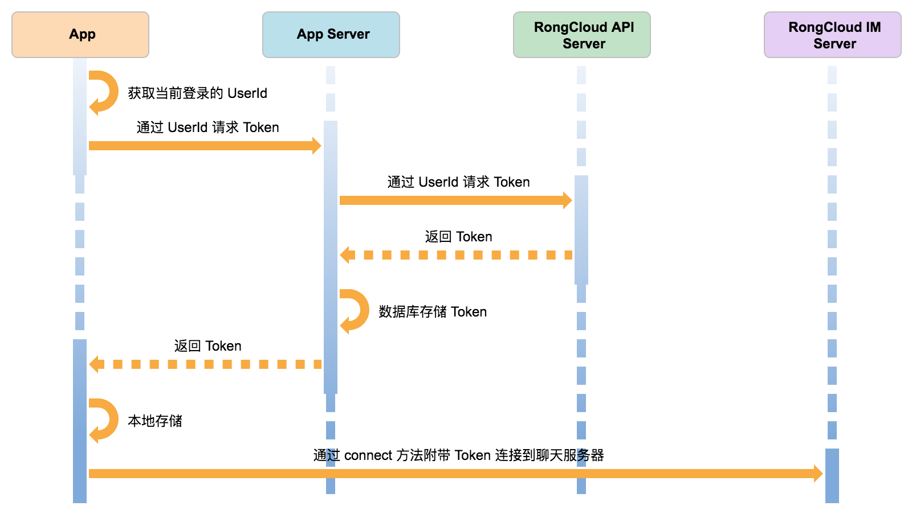

# 融云

[文档地址](https://www.rongcloud.cn/docs/quick_start.html)

* 好友关系保存在自己的服务器上
* 消息通道建立在融云的服务器上
* app 自己的服务器和融云的服务器做交互, 进行身份认证. 

## sdk

### IM 界面组件

IM 界面组件(IMKit) 是融云 SDK 的核心特色之一。融云将即时通信产品中最复杂的会话列表、聊天窗口、消息内容展现、会话设置等功能封装为组件，通过简短的代码，您就可以直接将以上界面集成到您的 App 产品中，省去大量的开发调试时间。融云同时支持业内最丰富的自定义界面组件功能，您可以针对自己界面需求自由设计开发。

(IM集成文档)[https://www.rongcloud.cn/docs/ios.html]

### IM 通讯能力库 

IM 通讯能力库(IMLib) 是不含界面的基础 IM 通讯能力库，封装了通信能力和会话、消息等对象。引用到 App 工程中后，需要开发者自己实现 UI 界面，相对较轻量，适用于对 UI 有较高订制需求的开发者。

(imLib集成文档)[https://www.rongcloud.cn/docs/ios_imlib.html]

### 实时音视频通讯能力, 小视频功能组件, 位置功能组件, 第三方推送组件, 红包功能组件

### 概念

#### 单聊

指两个用户一对一进行聊天，两个用户间可以是好友也可以是陌生人，融云不对用户的关系进行维护管理，会话关系由融云负责建立并保持，当 App 在后台运行或者 App 进程被杀死后，有新消息时会收到推送通知。

#### 群组聊天

群组指两个以上用户一起进行聊天，群组成员信息由 App 提供并进行维系，融云只负责将消息传达给群组中的所有用户， App 在后台运行或者 App 进程被杀死后可以收到推送通知。每个群最大人数上限为 3000 人，App 内的群组数量没有限制。

#### 聊天室

聊天室成员不设用户上限，海量消息并发即时到达，用户退出聊天界面后即视为离开聊天室，不会再接收到任何聊天室中消息，没有推送通知功能。会话关系由融云负责建立并保持连接，通过 SDK 相关接口，可以让用户加入或者退出聊天室。

#### 客服消息

用户与您的 App 后台客服进行消息通讯，支持文字、图片、位置、语音、表情、图文等消息类型，支持单客服和多客服服务，提供“机器人”和“人工”配合使用，可设置“机器人”或者“人工”优先接待功能。

#### 离线消息

当对端用户不在线的时候，融云服务器会将收到的消息保留 7 天，7 天内对端客户端如果上线，融云会直接将消息发送到对端，如果 7 天内对端客户端都没有上线，融云服务器将抛弃掉过期的消息。单聊、群组都支持离线消息，聊天室因为特殊的使用场景，不支持离线消息。

#### App Key / Secret

App Key / Secret 相当于您的 App 在融云的帐号和密码。是融云 SDK 连接服务器所必需的标识，每一个 App 对应一套 App Key / Secret。
融云提供了两套环境，开发环境和生产环境，前者是方便您集成开发和测试的，后者是 App 上线之后真正运营的商业环境。两者间数据隔离，避免开发环境数据和线上生产环境数据互相冲突。针对开发者的生产环境和开发环境，我们提供两套 App Key / Secret ，在正式上线前，请务必切换到生产环境。

#### Token

Token 即用户令牌，相当于您 APP 上当前用户连接融云的身份凭证。每个用户连接服务器都需要一个 Token，用户更换即需要更换 Token。每次初始化连接服务器时，都需要向服务器提交 Token。

### 集成融云 SDK 获取 Token 流程

### app 服务器功能

App Server 需要实现的功能：
获取 Token 的逻辑	实现调用 RongCloud Server 获取 Token 的逻辑获取 Token 方法
用户数据维护	融云不维护用户体系，需要 App Server 自己维护
用户好友关系维护	融云不维护用户好友关系，需要 App Server 自己维护
群组与群成员信息维护	群组信息与群成员信息，需要 App Server 自己维护

App Server 通过调用 RongCloud Server 接口还可以实现的功能：
聊天室服务	支持创建、销毁聊天室、查询聊天室的信息，聊天室成员禁言、封禁等服务，开发文档
群组服务	支持创建、加入、退出、解散群组，查询群成员，群组成员禁言服务，开发文档
用户封禁服务	开发文档
用户黑名单服务	开发文档
消息发送服务	支持发送单聊、群组、聊天室、系统会话类型消息，开发文档
推送服务	开发文档
消息敏感词	开发文档
在线状态订阅服务	开发文档
服务端实时消息路由服务	开发文档
消息历史记录下载服务	开发文档