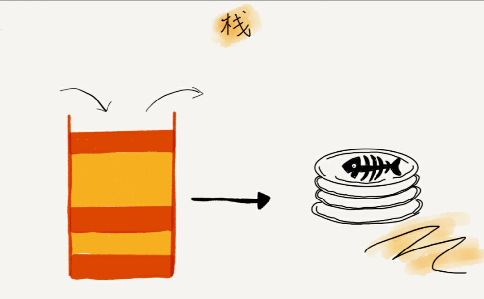
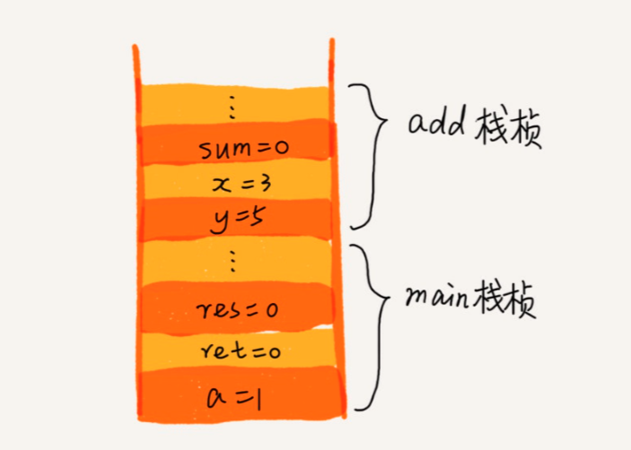

# 栈

## 概念

栈是一种操作受限的线性表, 只允许在一端插入和删除数据. 栈的特性可以概括为, 先入后出, 后入先出.

```C++
T pop(); // 栈顶元素出栈, 返回栈顶元素
void push(T t); // 入栈, 将 t 的值存储到栈顶
T peek(); // 返回栈顶元素, 但是不进行出栈操作
int size; // 返回当前栈中的数量.
```

上面是栈定义需要的操作, 可以看到, 栈仅仅提供了有限的操作. push 是将数据添加到栈中; pop 是删除栈顶的元素, 并返回; peek 是返回栈顶的元素, 但栈并不删除栈顶数据; 而 size 则返回栈中当前元素的数量.

栈的操作的安全性是程序员进行保证的. 例如, 如果栈中 size 返回值为0, 也就是栈中没有元素, 进行 pop 操作. 在这个时候, 各个系统的对栈实现类一般都会抛出异常. 这点在数组, 链表中也是一样, 数组链表在各个系统的实现类中, 都提供了 size 操作, 用于返回当前容器中元素的大小. 如果在编码的时候, 不通过询问 size 值直接调用增删改查操作, 各个类库在出错时都会抛出异常, 这其实是在帮助编程人员检查错误.



## 抽象数据类型

应该明确的是, 栈只是一个抽象数据类型, 所谓的抽象数据类型, 指的是拥有某些操作的数据类型, 但是这个数据类型内部是如何存储数据, 还有没有其他的操作, 和这个抽象数据类型无关. 这个概念, 特别像是接口. 而栈的具体实现, 一般都有着数组, 或者链表的结构, 通过对于数组和链表的操作, 达到存储数据, 提供入栈出栈功能的目的.
从某种意义上来说, Swift 的接口, 就是一种抽象数据类型. 因为利用接口的 primitive method, 可以构造更加复杂的方法.

既然内部使用的就是数组或者链表, 而数组和链表除了提供队尾添加删除数据, 还支持插入数据, 为什么不直接功能更广的数据结构, 反而用栈这种, 只能在一端进行数据操作的数据结构呢.

原因很简单, 因为使用栈的场景要求只能在一端进行数据的操作, 这样的限制可以保证数据安全不被破坏.
就如同类的设计, Api 少的类, 使用起来更加的方便, 不用出错.
不是说这个类的功能不强大, 而是类的逻辑正确性, 由类的设计者保证, 类的设计者暴露出去的方法越少, 这个类的内部数据, 受到损害的可能就越少.

栈就像一叠盘子, 在下面的盘子, 只能等待上面的盘子取走之后才能使用. 如果直接使用数组或者链表, 使用者就可以从中间剔除某些盘子, 或者更换某个盘子, 那么这叠盘子就不能保证最下面的碟子是最后才能被使用的了.

在实际的工作中, 可能已有类可以完成所需的功能了, 但是这个类可能暴露了太多的操作数据的接口了, 这个时候, 通过重新设计一个类, 对已有类进行封装, 仅仅提供有限的接口给外界, 而在实现中, 全部调用已有类的功能, 这种设计被称为适配器模式. 所以, 栈对于数组, 链表来说, 就是一个适配器.

## 栈的实现

前面讲过, 栈仅仅是数组或者链表的适配器. 所以, 在实现栈的时候, 完全可以通过已有的数组类或者链表类进行编码

```C++

class Stack {
    private:
        Array stash;
    public:
        void push(T value) {
            stash.append(value);
        }
        T pop() {
            if (!stash.size()) { 报错; }
            T value = stash[stash.size()-1];
            stash.removeLast();
            return value;
        }
        T peek() {
            if (!stash.size()) { 报错; }
            return stash[stash.size()-1];
        }
        int size() {
            return stash.size();
        }
}

```

从上面的代码可以看到, 栈的内部, 有着一个数组类的对象, 通过完全调用数组类的接口, 来达到 push, peek, pop 的功能.

链表栈的实现和数组栈的实现类似, 在栈中包含一个链表类的对象, 操作这个链表对象就可以了. 栈的实现并不难, 只需要记住, 它的作用, 是为了提供限制, 而不是为数组, 链表添加功能.
链表的实现, 要在内部记录一下 size 的大小.

## 栈的应用

* 调用栈

```c++
int main() {
    int a = 1;
    int ret = 0;
    int res = 0;
    ret = add(3, 5);
    res = a + ret;
    print("%d", res);
    return 0;
}
int add(int x, int y) {
    int sum = 0;
    sum = x + y;
    return sum;
}
```

系统在进行函数调用的时候, 就是使用了栈这种结构.

上面的函数会在系统的栈空间上占据响应的空间. 它们在内存的表示如下图:



在 main 运行时, 会在栈空间上占据一部分空间, 在 mian 函数运行时, 会调用 add 函数, add 函数的执行会压入另外一部分空间, 叫做栈帧. 每个栈帧里面, 存放自己函数执行所需要的信息. 因为, main 函数的执行, 需要得到 add 函数的执行结果才能继续执行. 所以先是 main 函数栈帧入栈, 然后是 add 函数栈帧入栈. 在 add 函数运行结束之后, add 函数栈帧出栈, main 函数的到返回结果, 继续执行 add(3, 5) 后面的代码, 在 return 0 的时候, main 函数的栈帧出栈.

只要是函数调用, 必然是这样的一个流程. 函数调用栈的这种组织方式, 可以保证调用函数的数据一直存活, 而被调动函数在执行完自己的代码之后, 栈帧出栈, 将代码的控制权交还给调用函数.

栈帧的大小是固定的. 在程序运营的一开始, 该函数会有多少空间保存在栈上就已经确定了. 所以, 函数内部所有的可变长度数据, 都是在操作堆空间上面的数据.

* 递归

递归调用是一种很常见的编程技巧. 简单来说, 就是自己调用自己. 不过在调用的时候, 会将数据规模进行减少, 直到达到递归终止条件, 然后进行回溯. 从上面的调用栈中我们知道, 递归调用, 每一个调用者函数, 其实都没有退出, 它需要拿到被调用函数的返回值后, 才能进行后续的操作. 所以递归的时候, 会有大量的栈帧存在. 我们可以自己组织一个栈对象, 模拟函数入栈的过程, 将递归函数改写为非递归函数.


所有的, 需要存下一个值, 然后在某个适当的时机在使用的业务场景, 都可以用栈来思考一下.
