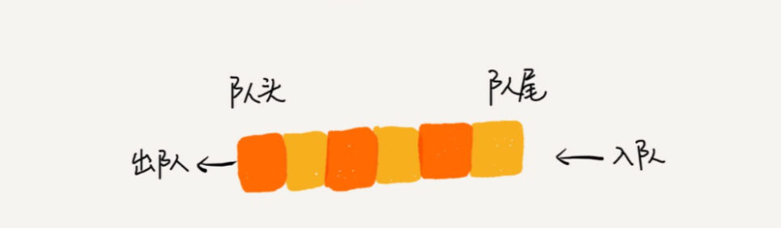

# 队列

## 概念

队列同栈一样, 是一种操作受限的线性表. 它的受限操作为 `只能在一端插入, 而在另外一端删除`.  它的特点一般描述为, 先进先出, 先来先服务, 后来后服务.

队列, 是实现广度优先搜索的数据结构. 二叉树的遍历, 最短路径问题, 都是可以根据队列来实现的. 

同样的, 队列是一种抽象数据类型, 队列中的元素应该可以认为是同种类型元素, 它的操作为

```C++
bool isFull(); // 判断队列是否已满
bool isEmpty(); // 判断队列是否为空.
int size(); // 返回当前队列中元素的个数
void enQueue(T item); // 入队操作, 向队列末尾增加一个元素.
T deQueue(); // 出队操作, 从队列头取出一个元素.

enQueue, deQueue
push, pop
这都是非常固定的写法, 在各个语言, 都是通用的方法概念.
```



## 队列的实现

同样的, 队列也可以认为是数组和链表的适配器. 所不同的是, 队列需要记录两个值, 一个是 front 表示队列头, 一个rear 表示队列尾. 之所以要记录两个位置, 是因为出队入队两个操作, 更改的是不同位置的值.

```C++

class Queue {
    private: 
        Array stash;
        int capacity;
        int front;
        int rear;
    public:
        Queue(int maxCapacity) { // 构造函数, 主要作用是初始化. 
            stash = Array(maxCapacity); // 该句的作用, 提前开辟maxCapacity个位置, 避免多次扩容操作.
            front = 0;
            rear = 0;
            capacity = maxCapacity;
        }
        int size() {
            return rear - front;
        }
        bool isEmpty() {
            return rear == front;
        }
        bool isFull() {
            reutnr rear == capacity;
        }
        void enQueue(T item) {
            if (isFull()) { 报错; }
            stash[rear++] = item;
        }

        T deQueue() {
            if (isEmpty()) { 报错; }
            return stash[front++];
        }
}

```

以上是利用已有 Array 容器类对于队列的实现. Array 内部本身会有自动扩容的机制, 所以在这里, 在构造函数的时候, 传入了最大的容量值, 用该值判断队列已满. 但是上面的这种实现有问题, 当一个队列多次入队出队的之后, 数组前面的位置就不会被再次利用, 就算数组只有几个元素在, 但只要 rear 的值到达了capaciy, 那么队列还是会认定为满.

``` C++
// 循环队列的实现.
class Queue {
    private: 
        Array stash;
        int capacity;
        int front;
        int rear;
    public:
        Queue(int maxCapacity) { // 构造函数, 主要作用是初始化. 
            stash = Array(maxCapacity + 1); // 该句的作用, 提前开辟maxCapacity个位置, 避免多次扩容操作.
            front = 0;
            rear = 0;
            capacity = maxCapacity;
        }
        int size() {
            if (rear >= front) { return rear - front; }
            reutrn capacity - front + 1 + rear;
        }
        bool isEmpty() {
            return rear == front;
        }
        bool isFull() {
            reutnr (rear+1) % capacity == front;
        }
        void enQueue(T item) {
            if (isFull()) { 报错; }
            stash[rear] = item;
            rear = (rear+1) % capacity
        }

        T deQueue() {
            if (isEmpty()) { 报错; }
            T result = stash[front];
            front = (front+1) % capacity
        }
}
```

以上是循环队列的实现方式, 循环队列的思路是, 当 rear 到达 capacity 的位置的时候, 如果数组前面还有空间, 那么 rear 就转移到数组的起始位置. 这样就能够重复利用数组前方的位置. 但是这样做又会引起新的问题, 之前判断队列为空的方式是 front == rear, 而循环队列在一直入队的情况下, rear会"追上"front, 这个时候, 队列里面是全部存储了数据, front == rear. 同时会有两种情况出现 front == rear, 导致队列空还是队列满无法判断. 所以, 在循环队列的实现中, 会浪费掉一个空间作为满队列的判断依据, 也就是当 rear 指针的下一个位置是 front 的时候, 认为队列为满, 此时 rear 的位置不可以再进行入队操作.

### 队列的应用

队列在应用场景非常广. 如果想要实现有序的效果, 那么几乎都是在用队列.

几个不同的平台, 在实现异步处理的时候, 都采用了队列存储任务的方式, 队列中的任务, 可以理解为回调函数. 在程序运行过程中, 当发生某个事件的发生后, 或者代码中提交某个异步任务时, 并不会立即执行事件的回调函数或者这个异步任务, 而是将所有的异步任务存放到一个队列中, 提交任务的代码会在任务提交之后立马返回执行下面的操作. 系统会在在下一个运行循环到来之时, 将任务从队列中取出依次取出执行. 所以提交任务之后的代码, 一定会比提交的任务早执行, 因为这两段代码分属于不同的运行循环. 而队列中的任务, 会按照提交的顺序有序执行.

如果我们平时想要完成有序的操作, 也是可以利用队列. 将待处理的数据, 放入到一个队列中, 然后在处理函数中, 依次取出队列中的元素进行操作. 如果仅仅是这样, 用数组就足够了, 因为数组就自带有序的概念. 但如果, 在处理队列的过程中, 又会产生新的数据需要处理, 那么用队列就比较适合. 处理函数是一个循环操作, 循环结束的标志是队列为空, 在处理的过程中, 将产生的数据, 直接进行入队, 这样新产生的数据可以直接影响循环的结束条件. 利用队列的提供方法, 可以避免处理数组的下标问题, 将其中的调度交由队列, 可以减少代码的复杂度.
