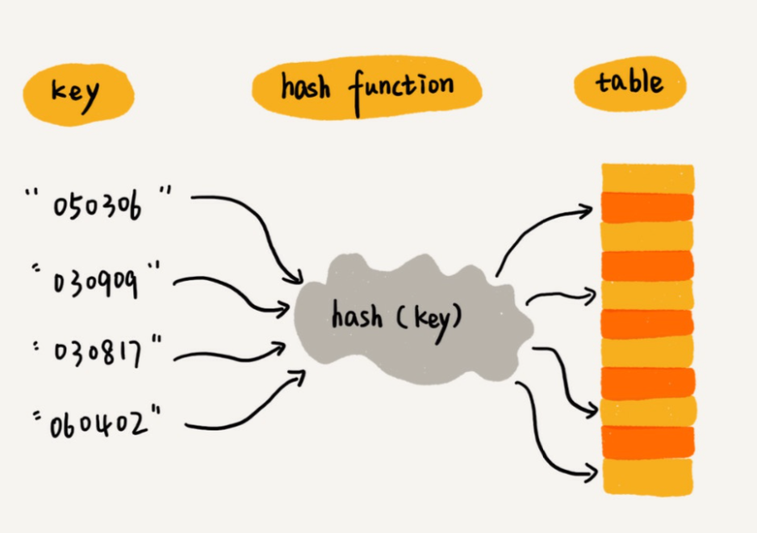
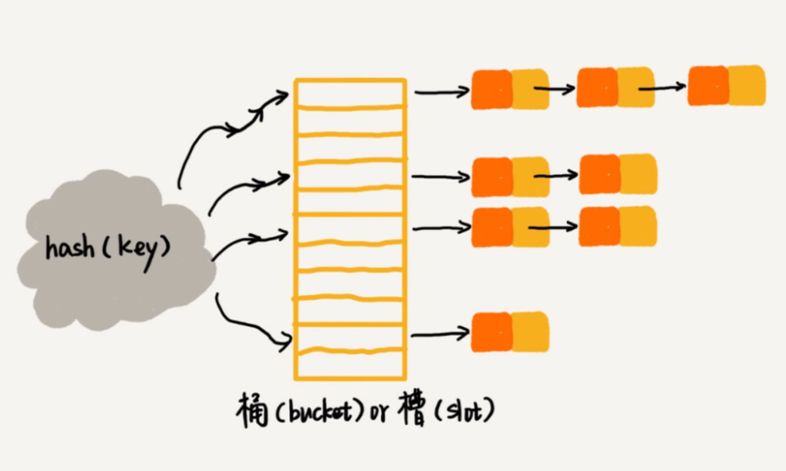

# 散列表

## 概念

前面讲到的都是线性表, 所谓的线性表, 就是各个数据中拥有着逻辑上的前后关系. 数据的遍历操作, 一般也是从前面的元素, 遍历到后面的元素, 但是这种数据结构有个问题, 就是想要查询某个元素是否在容器中的时候, 需要从头开始遍历, 直到发现某个位置的值满足条件位置. 而散列表, 就可以达到数据快速查找的目的.

散列表利用的是数组支持按照下标随机访问数据的特性，所以散列表其实就是数组的一种扩展，由数组演化而来.  

在各个数据类中, 一般都有着 hash 函数, 该函数返回值是一个非负整数. 为什么会是一个非负整数呢, 因为数组的下标是从 0 开始的整数. 散列表的底层存储就是一个容量有限的数组, 在一个数据想要存储到散列表的时候, 首先需要根据这个数据的 hash 函数, 算出一个散列值, 根据这个散列值可以得到这个数据在数组中应该存放的位置, 然后将数据存放到相应的位置.  

在之后判断某个数据在没在散列表的时候, 或者从散列表中取出某个 key 值对应的数据的时候, 也是通过这个数据的 hash 算法, 首先算出位置信息, 然后直接通过位置信息在数组中进行取值. 在这个过程中, 可以直接定位到数据的存储位置, 而不再需要数组的从头开始的遍历. 所以, 散列表的操作要快的很多.

## hash 函数

散列函数的作用就是通过某种转换规则将数据转换为某个 unsigned int 值, 这个 unsigned int 值会被转化成数组的位置信息.

这个函数有着几点要求:

* 运算速度一定要快, 否则会影响整个散列表的性能
* 如果 key1 == key2, 那么 hash(key1) == hash(key2)
* 这个值的运算结果要尽量的均匀分布, 否则会出现大量的 hash 冲突

首先, hash 函数不能太复杂, 因为散列表的作用就是加快判断数据在不在散列表中, 数据在散列表中的插入删除查询操作会很频繁, 太复杂的算法会直接影响性能.

第二, 如果逻辑上相等, 它们的存储位置也要认为是相等, 因为 hash 算法就是根据数据的内容计算出来的.

第三, hash 值的作用是计算出数据在数组中的位置, 但这个位置如果大量的集中在某个区域, 就会造成大量的冲突, 为了解决这些冲突, 会付出空间和计算的代价.  

冲突是不可避免的, 因为数据是无限的, 而数组的长度是有限的, 总会出现不同的数据得到相同的位置的情况, 针对这种情况, 有着不同的解决冲突的办法.

## 散列冲突

前面讲到, 散列冲突是无法避免的. 我们将数组中的每个位置认为是一个 bucket, 那么当数据增大的时候, bucket 被占用的越来越多, 一定会出现一个 bucket 要装载两个数据的时候. 现有两种不同的解决冲突的思路.

1. 开放寻址法

开放寻址法的思路是, 当出现了 hash 冲突的时候, 重新查找另外一个空间, 将数据添加到这个空间上. 如何探测另外的一个空间, 有着线性探测, 二次探测, 双重散列等方法. 思路都是查找另外一个位置, 然后将数据插入到这个位置上.  

不过这种解决方案有着很大的问题, 首先就是, 一个数据的位置, 不再能简单的从 hash 函数中确定. 所以在查询和删除的操作的时候, 要多次调用探测函数, 耗费计算性能, 也会让编码的复杂度大大增加. 再者, 数组中的位置总是有限的, 这种方式会很快的将数组的各个位置占据满, 这个时候就不可避免的要进行数组的扩容.

1. 链表法

基于开放寻址法的复杂性, 我们着重讲解一下链表法.

链表法的思路是, 每一个数组的 bucket 中, 存储的是一个链表, 然后将 hash 函数相同的数据依次的添加到这个链表中. 在查询某个数据是否在散列表中的操作是, 首先是找到这个链表, 然后在链表上进行遍历.

为什么链表法中用到了顺序遍历, 散列表的查询速度还是可以保障呢?  

链表虽然是顺序遍历, 但是找到链表的过程, 首先就会过滤绝大多数的元素. hash 值能够直接计算出数组中的位置, 而数组的随机访问的特性, 使得找到链表的操作几乎不耗费时间. 并且散列表的内部会有动态的调整存储数组的大小, 使得每一个 bucket 上, 链表的长度都不会过大, 这样链表的遍历操作的时间也会降低.

## 散列表性能调优

1. 散列函数的选择

散列函数的设计, 直接影响到散列表的性能. 复杂的散列函数, 会让散列表的各个操作变慢, 而分布不均匀的散列函数, 会让冲突过多, 解决冲突的几率大大增加.

一般来说, 散列函数的设计, 是交由各个数据类实现的. 而各个类库已经提供了基本数据信息的 hash 算法, 例如 字符串,  double值, int值, 日期等基本数据类型. 在设计自定义数据的散列函数的时候, 可以根据数据中主要属性的散列值, 进行简单的操作, 计算出最终的结果. 比如, 一个学生类的数据中, 最重要的是学生的学号, 那么就可以直接把学号的散列值当做整个学生数据的散列值, 如果没有这样一个主键性质的数据, 可以将主要数据的散列值进行相加.

1. 散列表的动态扩容

无论选择怎么样的解决冲突的策略, 当散列表中的数据不断加大的时候, 散列表的性能一定会受到影响, 这个时候, 应该选择增大散列表底层的数组的长度, 重新填充各个数据在数组中的位置. 不同的类库, 有着不同的扩容的算法. 定义装载因子=数据个数/数组长度, 在装载因子大于某个值的时候, 散列表内部会按照某个系数, 例如 1.5, 2.0 新生成一个数组, 然后将原有数组中的元素, 重新计算在新数组中的位置. 扩容之后, 数组的长度发生了增长, 原有的数据的位置进行了改变, 原有的链表的平均长度值就会进行缩减. 这样就能够减少遍历链表时所花费的时间.

## 应用

散列表, 可以说是应用非常广的数据结构了. 基本上程序中 key-value 对应的操作, 都可以通过散列函数进行. 键值编码现在已经是程序处理的标配了. json 的解析, 各个类库中字典, 或者map 的使用, 都可以通过 hash 表进行实现. 在这种 key value 编码技术中, key value 会被封装到一个数据对象中, 在操作散列表的时候, 例如`data["3527"] = "New data"`, 散列表内部会将 "3527"和"New data" 当做初始化参数生成一个新的对象, 然后将这个对象存储到散列表的内部. 所以, key - value 对应存储只是程序的编码给我们的假象, 真正的存储时, key - value 是存储在一起的. 而 set 和 hashMap 并没有多大的区别, set , hashMap 都是将值存储到 hash表中, 只不过 set 对应的数据项, key == value, 而 map 存储的数据项, key, value 是不同的值而已.

不过, 散列函数是一种无序的数据结构, 因为 hash 算法本身就不能保持有序, 所以, 为了能够有序的遍历其中的数据, 可以

* 拿到散列表的所有数据之后, 进行排序操作, 然后对排序后的数据进行操作
* 支持键值编码的还有一种叫做红黑树的数据结构, 红黑树的底层实现过于复杂, 也没有必要完全搞懂其中的实现, 它基本思路是在每一次添加删除的时候, 进行树的调整, 使得本身近似等于等于完全二叉树, 这样在树上的各个操作的执行效率保持的 log n 的时间复杂度上.
* 自己维护一个有序链表, 在插入删除的时候, 除了维护散列表中的数据, 还要维护该有序链表中的数据, 不过这种方法一般内嵌于各个容器类内部中, 自己实现过于复杂.

简单来说, 散列表是利用数组的随机访问特性可以快速确定数据位置的数据结构, 它的内部会提供维护性能的调优机制, 在各种需要键值编码的场合, 都可以使用到这种数据结构.

散列表其实是一种空间换时间的数据结构, 用更多的空间占用, 减少查询操作耗费的时间. 散列表不会完全的利用底层数据的空间, 因为随着装载因子的增高, 散列表内部会进行扩容, 目的就是讲数据能够均匀的分散到数组内部. 并且, 散列表的设计, 是牺牲了有序性, 在散列表的遍历的时候, 通用的遍历方式是按照数组进行遍历, 然后在数组中有值的情况下输出其中的内容, 如果数组中的值是一个链表, 则遍历链表输出其中的内容. 而这种方式遍历, 得到的数据是无序的. 