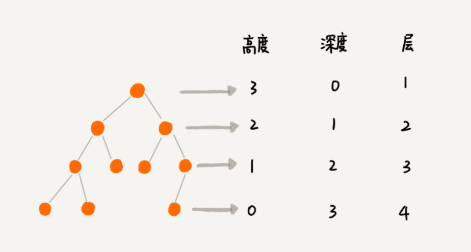
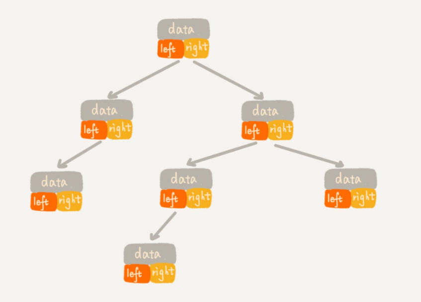
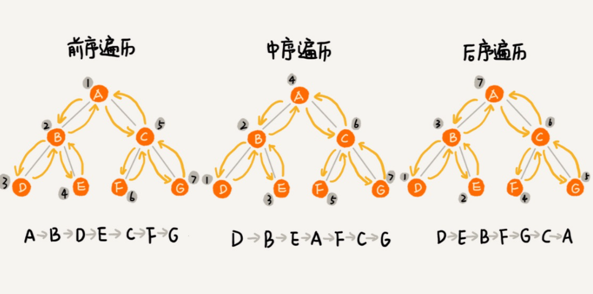

# 树

## 概念

基本的数据结构, 只有数组和链表. 栈, 队列, 是一种抽象数据类型, 可以认为是线性数据结构的适配器, 它们的底层实现, 可以是数组, 也可以是链表. 散列表的高效, 是建立在数组的随机访问的特性之上的, 而解决散列表冲突的链式存储法, 用的是链表.  

数组, 作为连续的内存空间, 虽然有着对于内存连续性的苛刻限制, 但是随机访问的特性, 让它是效率上的保障. 而链表, 则能够利用内存中各个地方的空余空间.   

链表中最重要的就是指针域概念的引入, 指针, 代表的是内存的地址. 将地址进行存储, 就可以将数据通过指针进行串联, 虽然访问的效率不如数组, 但却能组织出各种各样符合当前使用环境的数据模型.  

树的定义很多, 但是基本的思路就是, 这种数据结构, 通过指针将拥有层级关系的数据进行了组织. 



树这种数据结构真的很像我们现实生活中的“树”，这里面每个元素我们叫作“节点”, 用来连接相邻节点之间的关系，我们叫作“父子关系”. 树是对于层级关系最简单的表示. 树中的节点不能成环, 一个节点只和父节点, 子节点相连, 不和自己的兄弟节点相连. 

那么树这种结构有什么用呢?  父对象下包含子对象, 子对象又是其他对象的父对象, 这种关系非常普遍, 例如, 一个组织的层级关系, GUI 系统中视图的层级关系, 大任务和分散出来的子任务的层级关系等等. 不过, 主要注意的是, 树只是这种关系的表示, 真正有价值的还是数据本身.   

许多树的讲解中, 单纯的讲解树通过指针进行了串联, 但没有指出树只是数据的载体, 真正的作用是帮助我们找到相应的数据.  树通过指针域, 将数据进行组织和串联, 所以树中的节点, 包含数据域和指针域两种不同功能的空间.

## 二叉树

一个树的节点, 可以有很多的子节点, 二叉树规定了, 每一个节点最多只有有两个节点. 应用的最多的也是二叉树这种模型, 因为其他类型的树, 都可以转换成为二叉树. 



之前也讲过, 树是为了数据能够良好的组织, 引入的一种数据结构. 如果考虑树和链表的区别, 发现只不过是链表节点的 next 指针, 变为了 left, right 指针而已. 但这只是物理上的变化, 而含义上, 是从线性关系, 改变成为了层级关系了. 树的遍历, 指的是如何访问出树中的每一个节点,  和其他数据类型的遍历一样, 都是非常常见的行为.

* 先序中序后序遍历

这三种遍历方式, 都是利用了递归的技巧, 三者的差别, 仅仅是访问节点的语句的位置不同.



前、中、后序，表示的是节点与它的左右子树节点遍历打印的先后顺序。
前序遍历是指，对于树中的任意节点来说，先打印这个节点，然后再打印它的左子树，最后打印 它的右子树。
中序遍历是指，对于树中的任意节点来说，先打印它的左子树，然后再打印它本身，最后打印它 的右子树。
后序遍历是指，对于树中的任意节点来说，先打印它的左子树，然后再打印它的右子树，最后打印这个节点本身。

```c++
void preOrder(Node* root) {
    if (root == null) return;
    print root // 此处为伪代码，表示打印 root 节点
    preOrder(root->left);
    preOrder(root->right);
}
void inOrder(Node* root) {
    if (root == null) return;
    inOrder(root->left);
    print root // 此处为伪代码，表示打印 root 节点
    inOrder(root->right);
}
void postOrder(Node* root) {
    if (root == null) return;
    postOrder(root->left);
    postOrder(root->right);
    print root // 此处为伪代码，表示打印 root 节点
}
```

## 树的层次遍历

树的层次遍历是指, 按照树的层级顺序访问元素. 它的代码中利用了队列这种数据结构.

```c++
queue =  [node]  // 新建一个队列，并将根节点放入队列
while queue.lengh != 0
    item = queue.shift // 弹出队列的头部元素
    do_something(item)    //  操作该节点：比如存入一个数组或者打印
    queue.push(item.left)  if item.left  // 将左子节点存入队列
    queue.push(item.right) if item.right  // 将右子节点存入队列
```

## 二叉查找树

树除了表示层次关系之外, 还有一个重要的作用, 就是作为关联式容器使用.

之前讲到过一种关联式容器, 散列表, 散列表通过 key 值得 hash 值, 可以找到 value 应该存放的 bucket 的位置, 然后在 bucket 的链表中寻找对应的 value 值. 这是一种, 通过 hash 值过滤掉大部分无用数据来达到快速查找的方法. 想要快速查找到数据 ,关键就在于如何能够更多的过滤掉无效的数据, 二叉查找树的办法有点类似于二分查找, 每次查找尽可能过滤一半待查找区域. 所以, 查找树的时间复杂度, 一半都为 log(n)

二叉查找树的定义是, 父节点的左节点树上, 所有的数据都要小于等于该父节点, 父节点的右节点树上, 所有的数据都要大于该节点. 所有的节点, 都要符合这个模型. 这样, 在查找的时候, 如果要查找的 key 值就是父节点, 那么就直接返回父节点的数据, 如果比父节点小, 那么就去左子树中查找, 如果比父节点大, 就去右子树中查找. 这样的策略, 一次比较操作, 就能过滤一个分支的内容, 这要比数组或者链表顺序遍历查找的效率高很多.

不过, 为了维护查找树的模型, 在每次插入, 删除节点的时候, 都要调整树中元素的位置, 使之符合左子树小, 右子树大的模型. 除此之外, 如果查找树一个分支过长, 而另外一个分支过短的话, 每次比较之后, 可以过滤掉的数据太少, 也不能达到高效的查找, 所以, 在每次插入删除之后, 还要做查找树本身位置的调整, 力求达到每个节点的左子树高度和右子树高度相差不到1. 这种二叉查找树, 叫做平衡二叉查找树, 它的目的就在于, 让左右子树数据量接近, 这样一次比较能够过滤掉的数据平均也就越多.

那么各个容器类是如何利用二叉查找树, 达到容器类的各个功能呢.

首先, 关联式容器会有 key 和 value 两种数据, 这两种数据会被组合成一份数据, 作为树中节点的数据域. 而树本身是利用 key 的比较, 构建出节点的父子关系. 所以, 作为 key 的数据类型, 应该是一个有着比较操作, 并且比较操作不能耗费太多的性能, 常用的类库都使用字符串作为 key. 

在容器的插入操作中, 其实就是通过比较 key 的大小, 找到应该插入的节点位置, 进行树的插入操作. 在这个过程中, 会保持查找树的左小右大的特性并且进行平衡操作, 删除时, 也是通过 key 找到对应的节点进行删除, 然后进行维护左小右大的维护和平衡操作. 所以, 树作为存储结构来说, 想要保持它的高效性, 需要在每次对于树的操作时, 进行大量的维护性操作. 这种维护性操作主要是为了, 在查找时, 可以保持容器的高效. 在平衡二叉树中, 应用的最广的应该是红黑树, 不过这种数据结构过于复杂, 只要知道, 它是一种平衡二叉查找树就可以了.
