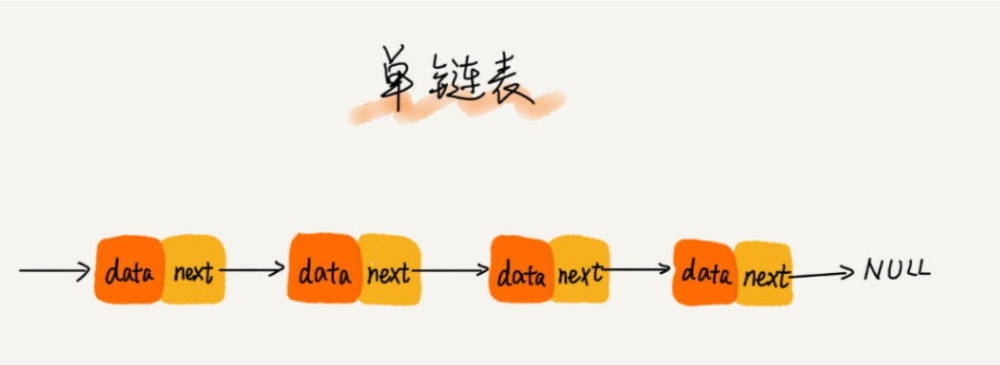
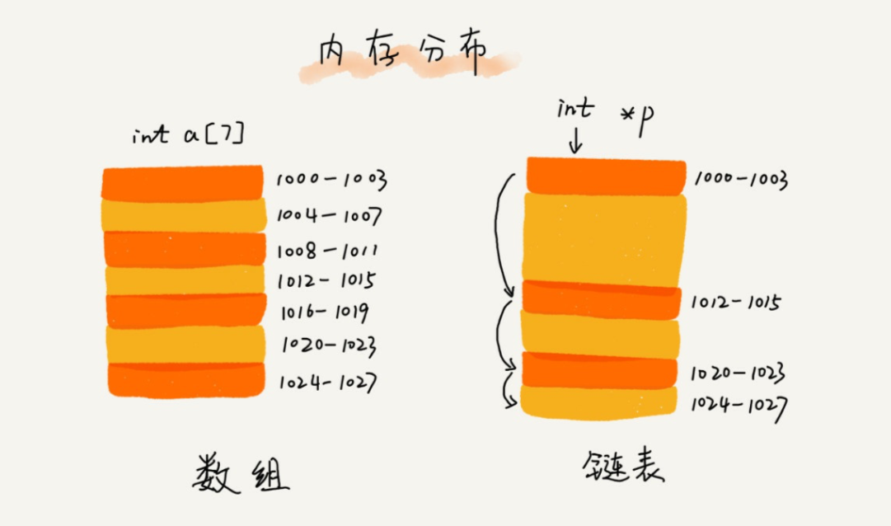

# 链表

## 概念

对于容器来说, 主要的工作是保存数据, 并提供对这些数据的各种操作. 每种容器都定义了自己的数据结构, 和与之相关的操作. 链表的名称, 很好的解释了自己的结构, 它是由互相连接的结点串联组合而成. 

``` C++
struct Node{
    int data;
    struct Node* next;
};
```

上面作为节点的定义, 其中 data 代表数据, 而 next 而代表下一个节点的指针. 在增加一个结点的时候, 需要将新增加的结点的指针, 赋值到上一个结点的 next 成员中, 由于每一个结点都保存着下一个结点的位置, 在得到第一个结点之后, 可以通过 next 指针, 访问到任意一个结点. 所有节点在进行插入, 删除的时候, 都会涉及到父节点的 next 的指向.


## 内存结构


从内存上来讲, 数组是一块连续的内存空间, 而链表, 则是一串相互独立的内存空间.  
数组的连续内存存储的特性, 使得数组有着可以 `高效随机访问, 低效插入删除` 的特性. 如果想要访问某个位置的结点, 通过地址计算式, 可以直接得到对应结点的内存地址, 但是为了维持这个连续的要求, 在插入删除的时候, 要进行大量的数据迁移. 而链表则刚好相反, 从图中可以看出, 链表的各个结点, 在内存中是属于不同的位置, 并不相连. 它们之间, 仅仅是通过指针进行串联. 一个结点属于一个链表, 指的是它上一个结点的 next, 指向自己, 而自己的 next, 又指向下一个结点.   
想要删除一个结点, 需要的仅仅是让自己上一个结点 的 next, 指向自己的下一个结点; 想要添加一个数据, 需要的仅仅是自己的 next 指针指向下一个结点, 然后将自己的位置赋值到上一个结点的 next 指针.   
虽然插入删除操作, 没有了数据迁移的工作, 但是由于这种分散的结构, 使得想要访问链表的特定位置的结点, 需要从头进行遍历, 直到访问到响应的位置. 链表的分散存储的物理结构, 导致链表有着 `低效随机访问, 高效插入删除` 的特点.

## 双向链表

链表的插入删除只是操作 next 指针就可以了, 但是由于单链表中, 每个结点都只是记录了自己的下一个结点的位置, 导致很多操作不便. 例如, 删除结点操作, 需要修改上一个结点的 next 指针指向下一个结点, 但如何得到上一个结点呢. 这个时候, 只能是从头结点进行遍历, 在判断 `某点结点.next == 要删除结点` 的时候, 才能确定出上一个结点. 这种操作导致删除, 添加结点, 需要进行一次遍历操作, 虽然链表删除添加结点仅仅需要操作 next 的指向, 但是查找上一个结点的过程是耗费性能的. 为了解决这个问题, 可以在结点的定义中, 可以添加 pre 指针, 指向结点的上一个结点的地址.

``` C++
struct Node{
    int data;
    struct Node* next;
    struct Node* pre;
};
```

在上面的定义式子中, 增加了一个 pre 成员, 专门记录上一个结点的地址, 这种结点组成的链表叫做双向链表. 通过 pre 指针, 可以很轻松的获取到上一个结点, 并且原来只能通过 next 指针进行正序的遍历操作, 现在通过 pre 指针, 可以进行逆序的遍历.

但是双向链表中 pre 指针不是没有代价的. 首先它有了更多的内存消耗, 链表和数组相比, 内存空间的利用率低, 因为结点的空间中, 需要专门留出一部分去记录下一个结点的地址, 如果数据域本身内存就不大, 那么很有可能一个结点需要的内存, 指针所占区域所占比重过大. 其次插入删除结点的代码中, 需要维护 next pre 两个指针的代码量, 代码的复杂度增加了. 而数组通过寻址公式, 是没有这些方面的顾虑的.

某个数据结构被设计出来, 是为了专门解决某个方面的问题. 数组的连续空间的特性, 在内存上其实是一种限制. 例如就算内存中有 200Mb 的空间, 需要定义一个 50MB 的数组, 但如果每一块都不超过 20MB, 那么还是不能利用这些空间, 因为数组的要求是连续. 而链表没有对于内存上的要求, 通过 next 指针, 可以利用内存中零散的内存块, 理论上来说, 可以无限的增加链表中的结点. 在操作上, 如果需要大量进行插入删除的操作, 链表的操作没有数据迁移的考虑, 效率要高的多.

## 注意点

* 操作链表, 首先要理解指针的含义. 对于没有指针的语言, 一般都有引用的这个概念. 在计算机看来, 引用就是指针, 都是对于内存地址的表示. 一般, 各个计算机语言都会定义一些基本数据类型, 这个基本数据类型内存空间都很小, 例如 int, double, 在传递这些数据的时候, 都是进行值的内存拷贝. 基本上每种语言, 都会有 swap 函数对实参起作用的讲解. 通过这些基本数据类型, 可以组织出空间更大, 更富有业务含义的数据类型, 比如 Person, Student. 对于这种占据空间大的数据类型, 每次传值都进行一次内存拷贝, 消耗实在太大, 所以就会允许传递地址值. 引用仅仅是语言对于地址的包装, 在实际的计算机指令中, 传递的就是内存地址.

* 注意指针的丢失. 在链表操作的时候, 顺序是一件非常重要的事情. 在插入一个结点的时候. `preNode.next = currentNode;currentNode.next = preNode.next` 这样的代码, 就会造成链表指针的丢失. preNode.next 指针先被覆盖, 后面的语句, 仅仅是让 currentNode.next 指向 自己. 正确的代码是 `currentNode.next = preNode.next; preNode.next = currentNode`. 在出现多个结点同时存在的时候, 指针的丢失是非常容易发生的, 这个时候, 命名的重要性就提现出来了.

* 内存的泄露. 在需要手动进行内存管理的语言中, 例如 C++, 结点在被删除之后, 这个结点的内存是应该被释放, 还是继续保留, 从来都是需要考虑的问题. 如果需要释放, 那么每次的结点删除操作, 都要在其中添加 free 语句, 相应的插入结点的操作, 也都需要 malloc 或者 new 语句. 内存管理从来都是一个复杂的问题, 如果链表中需要考虑内存管理, 那么整个代码的复杂度会增加很多.

* 注意链表的变形. 链表的定义很简单, 数据域 + 指针域. 数据域存储的是需要保存的数据, 指针域中保存的是下一个结点的位置. 这种数据 + 地址的结构, 基本上是最主流的数据存储的结构. 在GUI的程序库中, 有着 父视图和子视图的概念, 子视图中专门有一个指针指向父视图, 而父视图中, 专门有一个数组保存所有的子视图. 父视图子视图一般都是视图类的子类, 可以看做是同一种数据, 所以这其实就是一个链表结构. 在树形结构中, 一个父节点存储着两个或者多个子节点, 而子节点中也可能会存储着父节点的指针, 树形结构也可以看做是特殊的链表. 在所有的链表的变形中, 操作节点的时候, 都要注意维护相关节点的指针域的数据准确. 双向链表的应用场景要大大多于单向链表, 在更新双向链表的节点的时候, 所有的操作都要涉及更新该节点和父节点两部分的指针域的数据. 如果忘记更新某一端的数据, 整个链表结构都会失效.

